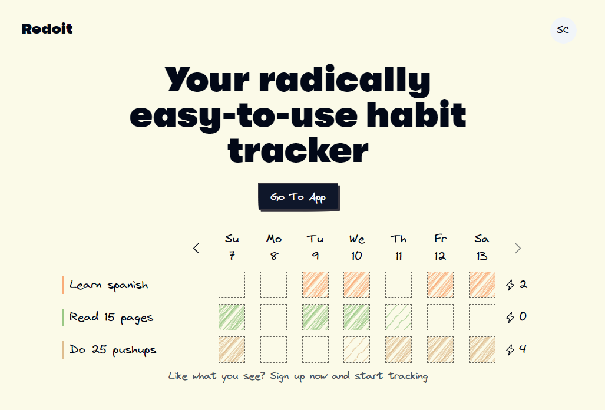
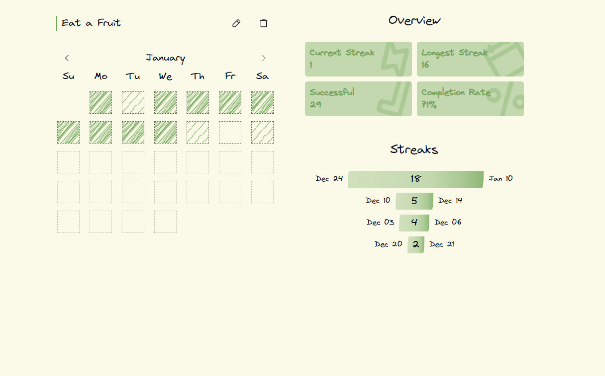

Redoit is an offline-first habit tracker designed to help users build and maintain positive routines.

### My Role

As the sole developer, I had the opportunity to work on every aspect of the project, from initial planning through development to deployment.

### Stack

<!-- Choosing React made the most sense, considering the upcoming development of a mobile version using React Native. This approach will enable better code sharing between both versions. I used Replicache to handle offline-first functionality. Next.js serves as the backend framework, and the decision to host the app on Vercel was natural, given its status as the default platform for Next.js projects.
Hosting the app on Vercel was a natural decision, given its status as the default platform for Next.js projects.  -->

- Frontend: React
- Offline Support: Replicache
- Backend: Next.js/postgresql
- Hosting: Vercel

Opting for React was a logical choice, particularly with the future development of a mobile version using React Native in mind. This approach will enable better code sharing between the web and mobile versions. I used Replicache to handle offline-first functionality. Serving as the backend framework is Next.js, and the decision to host the application on Vercel was a natural one, given its standing as the default platform for Next.js projects.

### Overcoming Challenges and Thought Process

#### Implementing Offline Support

One of the most significant challenges was implementing offline support for the existing backend. This proved to be a complex problem, considering the numerous edge cases and the critical need to handle server failures without risking data loss—especially crucial for a habit tracker where years of tracking data could be at stake.
After exploring various solutions, I chose Replicache, a client-side sync library designed for building real-time and local-first applications. Replicache was selected due to its exceptional reliability and seamless integration capabilities with most backends.

#### Future-Proofing the Tech Stack

Another challenge involved selecting a technology stack that not only works for the current web application but will also integrate smoothly with React Native in the future. This foresight ensures a seamless transition to mobile platforms and facilitates efficient code sharing.

<!--
As the project scaled, implementing changes became more time-consuming. Recognizing the importance of constant code refactoring, I learned to keep components small and modular. I also extracted certain functionalities into their own npm packages for maintainability. -->

### Lessons Learned

As the project scaled, implementing changes became more time-consuming. Recognizing the importance of constant code refactoring, I learned to keep components small and modular. This approach significantly improved the maintainability of the codebase. Additionally, I discovered the value of extracting certain functionalities into their own npm packages. This not only enhanced maintainability but also opened up possibilities for code reuse in future projects. These experiences reinforced the importance of thinking ahead and structuring code with long-term scalability in mind.
